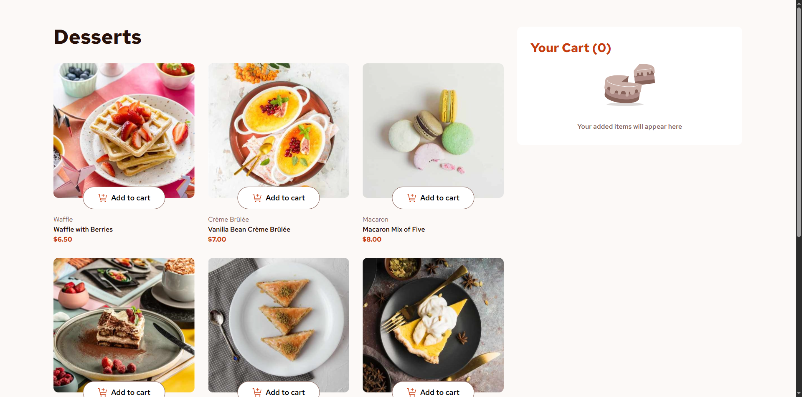

# Frontend Mentor - Product list with cart solution

This is a solution to the [Product list with cart challenge on Frontend Mentor](https://www.frontendmentor.io/challenges/product-list-with-cart-5MmqLVAp_d). Frontend Mentor challenges help you improve your coding skills by building realistic projects. 

## Table of contents

- [Overview](#overview)
  - [The challenge](#the-challenge)
  - [Screenshot](#screenshot)
  - [Links](#links)
- [My process](#my-process)
  - [Built with](#built-with)
  - [Development](#development)
  - [Continued development](#continued-development)
- [Author](#author)

## Overview

### The challenge

Users should be able to:

- Add items to the cart and remove them
- Increase/decrease the number of items in the cart
- See an order confirmation modal when they click "Confirm Order"
- Reset their selections when they click "Start New Order"
- View the optimal layout for the interface depending on their device's screen size
- See hover and focus states for all interactive elements on the page

### Screenshot



### Links

- [Solution](https://github.com/josejulio1/frontend-mentor-challenges/tree/master/product-list-with-cart)
- [Live Site](https://project-list-with-cart-josejulio.netlify.app)

## My process

### Built with

- Semantic HTML5
- Tailwind CSS
- Flexbox
- CSS Grid
- [React](https://reactjs.org)

### Development

First of all, I want to explain why I used a library like React for this solution. It has mainly been by two reasons:
- There are parts of the page that can be turned into components, such as the product cards, the cart items and the order items, creating a separation of logic and UI code. If i were to do this using vanilla JavaScript, I would have to create each DOM element myself. For example, the ProductCart component:
```js
class ProductCart {
  constructor(product) {
    const { name, category, price, image } = product;

    this.articleContainer = document.createElement('article');
    const pictureImage = document.createElement('picture');
    const sourceMobile = document.createElement('source');
    const sourceTablet = document.createElement('source');
    const img = document.createElement('img');
    // ...

    sourceMobile.srcset = image.mobile;
    sourceMobile.media = '(max-width: 375px)';
    sourceTablet.srcset = image.tablet;
    sourceTablet.media = '(max-width: 992px)';
    img.src = image.desktop;
    img.alt = `Image of ${name}`;
    // ...

    pictureImage.appendChild(sourceMobile);
    pictureImage.appendChild(sourceTablet);
    pictureImage.appendChild(img);
    // ...
  }

  getDom() {
    return this.articleContainer;
  }
}
```
- The ease of creating a shopping cart. In React, I can create a context to access information from any component (in this case I use the [Zustand](https://zustand.docs.pmnd.rs/learn/getting-started/introduction) library), and I also re-render the entire interface based on a single source of truth: the array of products in the cart. Thank's to React reactivity, the DOM automatically re-renders whenever I make a change to the cart, such as adding or remove a product. If I were to do this using vanilla JavaScript, I would have to include the necessary logic within every function like addProduct or removeProduct to re-render every part of the application where the cart is used. I would have to do something like this:
```js
const $productsGrid = document.getElementById('products-grid');
const $cart = document.getElementById('cart');
const $orderConfirmationModal = document.getElementById('order-confirmation-modal');

const products = [];

function addProduct(product) {
  products.push(product);

  rerenderProductsGrid(products);
  rerenderCart(products);
  rerenderOrderConfirmationModal(products);
}

function rerenderProductsGrid(products) {
  const documentFragment = document.createDocumentFragment();
  products.forEach(product => {
    documentFragment.appendChild(new ProductCart(product).getDom());
  });

  // Remove children of products grid
  while ($productsGrid.firstChild) {
    $productsGrid.removeChild($productsGrid.firstChild);
  }

  $productsGrid.appendChild(documentFragment);
}

// ...
```

On the other hand, I've used Tailwind because it significantly simplifies working with CSS. I don't have to create a separate CSS file for each component, nor do I have to worry about which class names to assign to each DOM element.

### Continued development

- Implement a REST API backend (such as Express, NestJS or Spring Boot) with database, and React Query to fetch the products with caching

## Author

- Frontend Mentor - [@josejulio1](https://www.frontendmentor.io/profile/josejulio1)