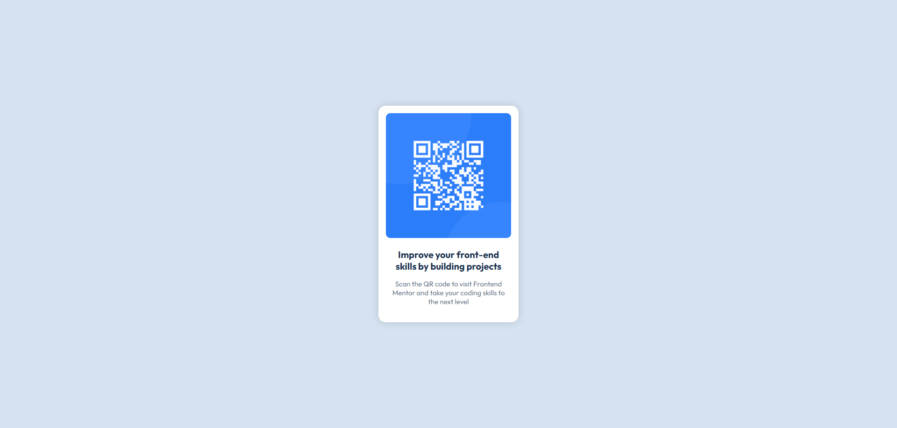

# Frontend Mentor - QR code component solution

This is a solution to the [QR code component challenge on Frontend Mentor](https://www.frontendmentor.io/challenges/qr-code-component-iux_sIO_H). Frontend Mentor challenges help you improve your coding skills by building realistic projects. 

## Table of contents

- [Overview](#overview)
  - [Screenshot](#screenshot)
  - [Links](#links)
- [My process](#my-process)
  - [Built with](#built-with)
- [Author](#author)
- [Acknowledgments](#acknowledgments)

## Overview

### Screenshot



### Links

- [Solution](https://github.com/josejulio1/frontend-mentor-challenges/qr-code-component)
- [Live Site](https://qr-code-component-josejulio.netlify.app)

## My process

### Built with

- Semantic HTML5
- CSS custom properties
- BEM Methodology
- Flexbox

### The process

I have organized the project in 2 folders: images and styles for the CSS, and in the root of project, the HTML.

After, I created the structure of HTML with CSS classes using BEM methodology, and importing the [Outfit Google Font](https://fonts.google.com/specimen/Outfit) in head tag.

I created two CSS files, [globals.css](styles/globals.css) and [styles.css](styles/styles.css).

The **globals.css** file is responsible of normalize the default CSS of all HTML tags, and makes the image responsive to container.

This code removes the default margin and padding from all HTML elements. The **box-sizing** property simplifies working with HTML elements because, by default, they use the **content-box** value; this means that if there is a 100px parent container and a 100px child container with a 10px border, the child border will extend beyond the parent container. This occurs because the calculation combines the child content (100px) with its border (10px on the left + 10px on the right = 20px), resulting in a total child width of 120px, whereas the parent container is only 100px wide. Using **border-box** factors the child border into its width calculation-effectively subtracting 20px from the 100px, so that it does not overflow the parent container.
```css
* {
    box-sizing: border-box;
    margin: 0;
    padding: 0;
}
```

This code makes that the image adapts to parent container.
```css
img {
    width: 100%;
}
```

The **styles.css** file contains the styles for the QR Code layout. To center the content in the middle of the screen, I use the **height** property on **body** tag to make the screen occupies the 100% of viewport. This allows me to center the QR Code container, because is inside of container with content (body).

I use **dvh** because if I use percentage, will not working because the percentage takes space of a parent container, and body is the first container in the DOM of content, so I need to use a fixed unit like dvh, that takes the size of viewport (the visible in the screen by the user).
```css
body {
    height: 100dvh;
}
```

After that, I use flexbox to center the QR Code container.
```css
body {
    display: flex;
    justify-content: center;
    align-items: center;
}
```

The rest of things, is use border-radius, flexbox and other CSS properties to get the desired result.

## Author

- Frontend Mentor - [@josejulio1](https://www.frontendmentor.io/profile/josejulio1)